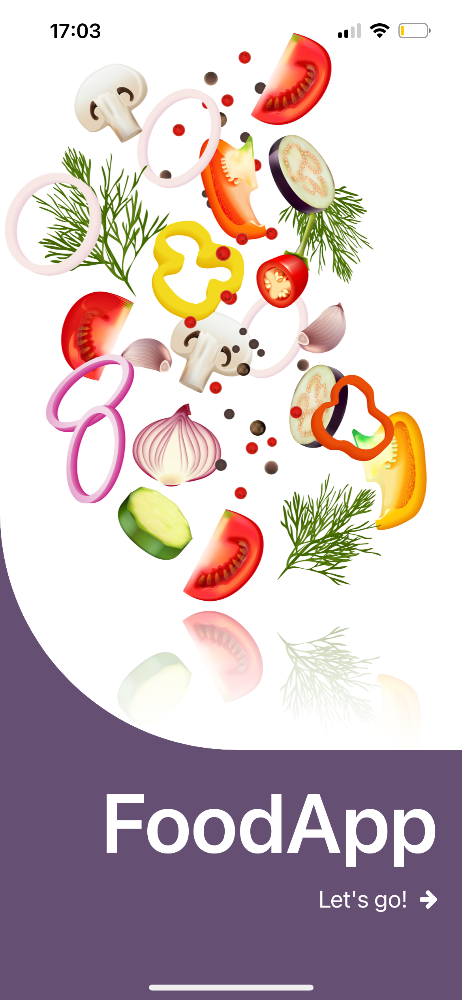
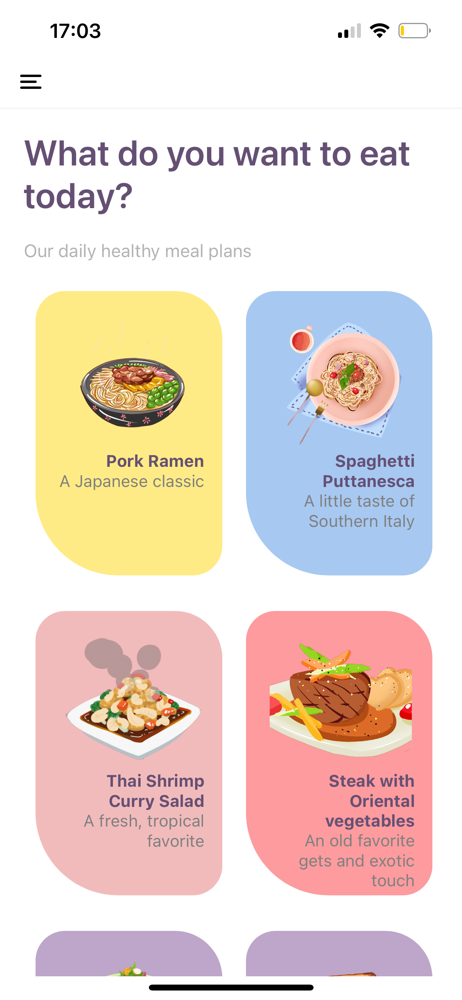
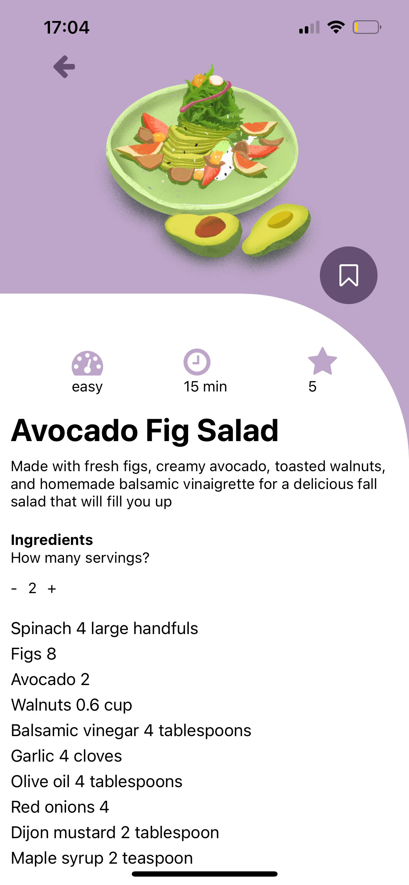
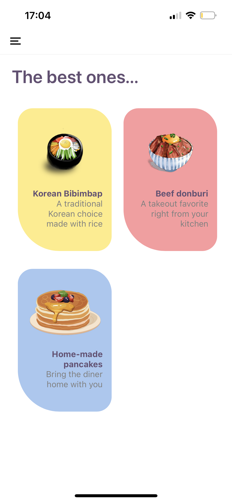
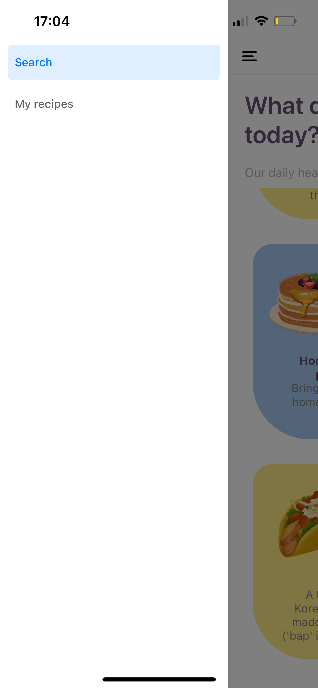

# FoodApp

Application mobile de recettes avec gestion des favoris, développée avec **React Native** et **Expo**.

---

## 📱 Fonctionnalités

- 📋 Affichage de recettes (depuis `recipes.js`)
- 🔍 Détail d’une recette : image, description, niveau, durée, note…
- 🍽️ Ajustement des portions, recalcul des quantités d’ingrédients
- ⭐ Ajout / suppression des recettes en **favoris**
- 🧭 Navigation entre les écrans : Accueil, Détail, Favoris
- ⚙️ State global avec Redux Toolkit

---

## 🛠️ Stack technique

- **React Native**
- **Redux Toolkit** pour la gestion d’état
- **React Navigation** pour la navigation entre les écrans
- **react-native-vector-icons** (FontAwesome)
- **Expo**

---

## 📸 Captures d'écran

### Écran d’ouverture
  

---

### Page d’accueil
  
*Liste des recettes disponibles pour explorer.*

---

### Détail d’une recette
  
*Informations complètes : image, description, niveaux, temps, et gestion des favoris.*

---

### Favoris
  
*Accès rapide à vos recettes préférées.*

---

### Menu Drawer
  
*Navigation simple et intuitive.*
